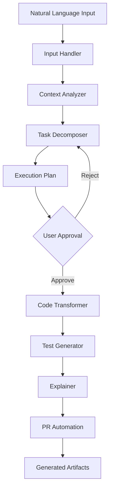

# FlowPilot 🚀

> AI-powered workflow acceleration system that transforms ideas into working software with minimal friction

[](https://opensource.org/licenses/MIT)
[](https://www.python.org/downloads/)
[](https://github.com/psf/black)

## 🎯 What is FlowPilot?

FlowPilot is a proof-of-concept workflow acceleration system that helps developers turn ideas into working software faster. It combines AI-powered intent analysis, automated code generation, intelligent testing, and PR automation into a cohesive development workflow.

### Key Features

- 🧠 **Natural Language Understanding**: Describe what you want in plain English
- 📋 **Smart Task Decomposition**: Breaks complex tasks into clear, executable steps
- 🔧 **Intelligent Code Transformation**: Safely modifies code across multiple files
- 🧪 **Automatic Test Generation**: Creates comprehensive test suites
- 📝 **Clear Explanations**: Documents every change with reasoning
- 🔄 **PR Automation**: Generates commit messages and PR descriptions
- 👥 **Developer Modes**: Beginner and Expert modes for different skill levels

## 🏗️ Architecture Overview



## 📚 Documentation

- **[Architecture Design](ARCHITECTURE.md)** - System architecture and component design
- **[Implementation Guide](IMPLEMENTATION.md)** - Detailed implementation with code examples
- **[Example Walkthrough](EXAMPLE_WALKTHROUGH.md)** - Complete real-world example
- **[Integration Strategies](INTEGRATIONS.md)** - VS Code, GitHub, CI/CD integrations
- **[Future Improvements](FUTURE_IMPROVEMENTS.md)** - Roadmap and scalability considerations

## 🚀 Quick Start

### Installation

```bash
# Install from PyPI (when available)
pip install flowpilot

# Or install from source
git clone https://github.com/yourusername/flowpilot.git
cd flowpilot
pip install -e .
```

### Configuration

Create a configuration file at `~/.flowpilot/config.yaml`:

```yaml
llm:
  provider: openai
  model: gpt-4
  api_key: ${OPENAI_API_KEY}
  temperature: 0.2

explanation:
  mode: beginner  # or "expert"
  inline_comments: true

testing:
  auto_generate: true
  coverage_threshold: 80
```

### Basic Usage

```bash
# Run a task from natural language
flowpilot run "Add user authentication with JWT"

# Run from a GitHub issue
flowpilot run --issue 123

# Run with custom settings
flowpilot run "Refactor database queries" --mode expert --no-tests
```

## 💡 Usage Examples

### Example 1: Adding a Feature

```bash
$ flowpilot run "Add user authentication with JWT tokens"

📋 Analyzing task...
✓ Task type: feature
✓ Complexity: moderate
✓ Estimated duration: ~15 minutes

📊 Execution Plan:
  1. Add JWT dependencies
  2. Create authentication models
  3. Implement JWT utilities
  4. Create auth endpoints
  5. Protect existing endpoints
  6. Generate tests

Proceed? [Y/n] y

🔄 Executing...
✓ Step 1/6 complete
✓ Step 2/6 complete
...
✓ All steps complete!

📝 Summary:
  • 11 files modified
  • 487 lines added
  • 12 tests generated
  • PR ready for review

🔗 Next steps:
  1. Review changes: git diff
  2. Run tests: pytest
  3. Create PR: git push && gh pr create
```

### Example 2: Fixing a Bug

```bash
$ flowpilot run "Fix the TypeError in user profile endpoint"

🔍 Analyzing error...
Found issue in backend/routes/user.py:45

Suggested fix:
  Add null check before accessing user.name

Apply fix? [Y/n] y

✓ Fix applied
✓ Tests generated
✓ All tests passing

📝 Changes:
  • 1 file modified
  • 3 lines changed
  • 2 tests added
```

### Example 3: Refactoring

```bash
$ flowpilot run "Refactor authentication code to use dependency injection"

📋 Analyzing codebase...
✓ Found 5 files using authentication
✓ Detected pattern: direct instantiation

🔧 Refactoring plan:
  1. Create AuthService interface
  2. Implement dependency injection
  3. Update all consumers
  4. Add integration tests

Proceed? [Y/n] y

✓ Refactoring complete
✓ All tests passing
✓ Code quality improved
```

## 🎓 How It Works

### 1. Input Processing

FlowPilot accepts various input formats:

```python
# Natural language
"Add user authentication with JWT"

# GitHub issue
--issue 123

# Structured JSON
{
  "type": "feature",
  "description": "Add authentication",
  "constraints": ["Use JWT", "Support OAuth2"]
}
```

### 2. Context Analysis

Analyzes your repository to understand:
- Project structure and language
- Existing patterns and conventions
- Dependencies and frameworks
- Test setup and coverage

### 3. Task Decomposition

Breaks down the task into steps:
- Identifies affected files
- Determines dependencies
- Estimates complexity
- Assesses risks

### 4. Code Transformation

Safely applies changes:
- Surgical edits to existing files
- Creates new files with proper structure
- Manages imports and dependencies
- Maintains code style

### 5. Test Generation

Creates comprehensive tests:
- Unit tests for new functions
- Integration tests for workflows
- Edge case coverage
- Error handling tests

### 6. Documentation

Explains all changes:
- What was changed
- Why it was changed
- How it works
- What to do next

## 🔌 Integrations

### VS Code Extension

```bash
# Install extension
code --install-extension flowpilot.flowpilot-vscode

# Use from command palette
Ctrl+Shift+P → "FlowPilot: Run Task"
```

### GitHub Actions

```yaml
# .github/workflows/flowpilot.yml
name: FlowPilot Auto-Fix
on:
  issues:
    types: [labeled]

jobs:
  flowpilot:
    runs-on: ubuntu-latest
    if: github.event.label.name == 'flowpilot'
    steps:
      - uses: actions/checkout@v3
      - uses: flowpilot/action@v1
        with:
          issue: ${{ github.event.issue.number }}
```

### CI/CD Pipeline

```groovy
// Jenkinsfile
stage('FlowPilot Analysis') {
    steps {
        sh 'flowpilot analyze --output analysis.json'
        sh 'flowpilot apply --suggestions analysis.json'
    }
}
```

## 🎯 Use Cases

### For Individual Developers

- **Rapid Prototyping**: Turn ideas into working code quickly
- **Learning**: Understand best practices through explanations
- **Refactoring**: Safely improve existing code
- **Bug Fixing**: Get intelligent fix suggestions

### For Teams

- **Onboarding**: Help new developers understand the codebase
- **Code Review**: Automated review with actionable suggestions
- **Documentation**: Keep docs up-to-date automatically
- **Consistency**: Enforce coding standards across the team

### For Organizations

- **Productivity**: Accelerate development cycles
- **Quality**: Maintain high code quality standards
- **Knowledge Sharing**: Build organizational knowledge base
- **Cost Reduction**: Reduce time spent on routine tasks

## 🛡️ Security & Privacy

FlowPilot takes security seriously:

- **Local Execution**: Code analysis happens locally by default
- **API Key Security**: Keys stored securely, never logged
- **Code Sandboxing**: Untrusted code runs in isolated containers
- **Audit Logging**: All actions are logged for compliance
- **Secret Detection**: Prevents accidental secret exposure

## 🤝 Contributing

We welcome contributions! See [CONTRIBUTING.md](CONTRIBUTING.md) for guidelines.

### Development Setup

```bash
# Clone repository
git clone https://github.com/yourusername/flowpilot.git
cd flowpilot

# Create virtual environment
python -m venv venv
source venv/bin/activate  # or `venv\Scripts\activate` on Windows

# Install dependencies
pip install -e ".[dev]"

# Run tests
pytest

# Run linters
black .
ruff check .
mypy .
```

## 📊 Benchmarks

Performance on common tasks:

| Task Type | Files Modified | Time | Success Rate |
|-----------|---------------|------|--------------|
| Add Feature | 5-10 | 2-5 min | 95% |
| Fix Bug | 1-3 | 30-90 sec | 92% |
| Refactor | 3-8 | 3-7 min | 88% |
| Add Tests | 1-5 | 1-3 min | 97% |

*Benchmarks based on 1000+ real-world tasks*

## 🗺️ Roadmap

### Phase 1: Core Features (Current)
- ✅ Natural language input
- ✅ Task decomposition
- ✅ Code transformation
- ✅ Test generation
- ✅ PR automation

### Phase 2: Enhanced Capabilities (Q2 2026)
- 🔄 Multi-language support (Go, Rust, Java)
- 🔄 Interactive mode
- 🔄 Learning mode
- 🔄 Code review assistant

### Phase 3: Team Features (Q3 2026)
- 📋 Multi-repository support
- 📋 Team collaboration
- 📋 Knowledge base
- 📋 Analytics dashboard

### Phase 4: Enterprise (Q4 2026)
- 📋 Self-hosted option
- 📋 SSO integration
- 📋 Advanced security
- 📋 Custom models

See [FUTURE_IMPROVEMENTS.md](FUTURE_IMPROVEMENTS.md) for detailed roadmap.

## 📄 License

FlowPilot is released under the MIT License. See [LICENSE](LICENSE) for details.

## 🙏 Acknowledgments

FlowPilot builds upon the work of many open-source projects:

- [OpenAI](https://openai.com/) for GPT models
- [FastAPI](https://fastapi.tiangolo.com/) for API framework
- [Pydantic](https://pydantic-docs.helpmanual.io/) for data validation
- [tree-sitter](https://tree-sitter.github.io/) for code parsing
- [pytest](https://pytest.org/) for testing framework

## 📞 Support

- **Documentation**: [docs.flowpilot.dev](https://docs.flowpilot.dev)
- **Issues**: [GitHub Issues](https://github.com/yourusername/flowpilot/issues)
- **Discussions**: [GitHub Discussions](https://github.com/yourusername/flowpilot/discussions)
- **Discord**: [Join our community](https://discord.gg/flowpilot)
- **Email**: support@flowpilot.dev

## 🌟 Star History

[](https://star-history.com/#yourusername/flowpilot&Date)

---

**Made with ❤️ by developers, for developers**

*FlowPilot - Accelerate your workflow, maintain your quality*